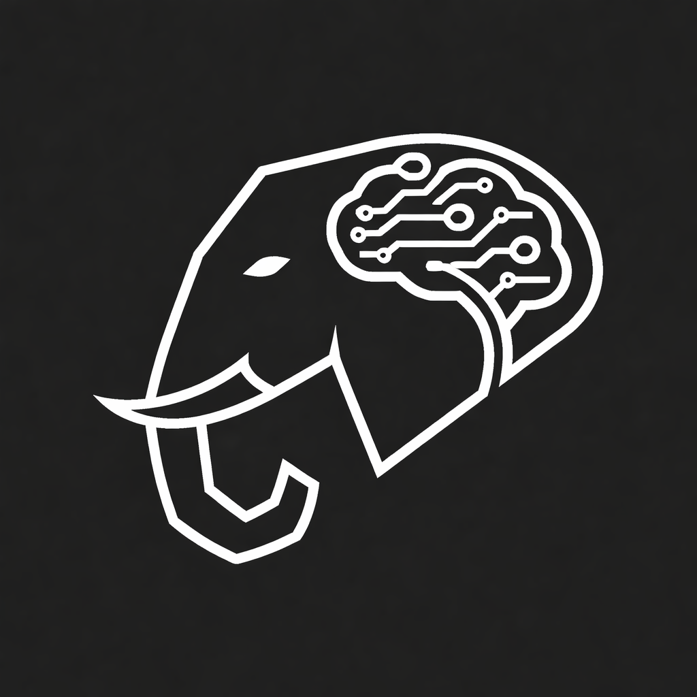

<p align="center">
  
</p>

<h1 align="center">Recall</h1>

<p align="center">
  <strong>Unified AI Memory — Your AI agents finally remember everything.</strong>
</p>

<p align="center">
  Screen captures, Slack threads, Notion docs, past AI conversations — all searchable by any AI agent via MCP.
</p>

<p align="center">
  <a href="#-quick-start">Quick Start</a> &nbsp;·&nbsp; <a href="#-how-it-works">How It Works</a> &nbsp;·&nbsp; <a href="#-features">Features</a> &nbsp;·&nbsp; <a href="#-mcp-tools">MCP Tools</a> &nbsp;·&nbsp; <a href="#-dashboard">Dashboard</a>
</p>

---

## The Problem

Your AI assistant is **blind**. It can't see the Slack thread where your team discussed the bug you're fixing. It doesn't know about the Notion doc with your architecture decisions. Every session starts from zero.

**Recall fixes that.** One unified memory. Every source. Any AI agent.

---

## How It Works

```
You work normally
        ↓
Recall captures everything (screen, Slack, Notion, AI chats)
        ↓
GPT-4.1-nano describes it → text-embedding-3-small embeds it
        ↓
Stored in Supabase pgvector + Moorcheh AI
        ↓
Any AI agent queries it via MCP
        ↓
Your AI finally has context
```

---

## Features

- **Smart Screen Capture** — Captures on app switch + 60s fallback. Deduplicates automatically. GPT-4.1-nano describes what's on screen (code, diagrams, UI — not just OCR text).
- **Slack & Notion** — OAuth connect, one-click sync, semantic search across all your messages and docs.
- **AI Agent Memory** — Watches Claude Code & Cursor conversation files. Past AI sessions become searchable context for future ones.
- **5 MCP Tools** — `search_memory`, `get_recent_context`, `get_source_context`, `save_memory`, `sync_source`. Works with any MCP-compatible agent.
- **Proactive Notifications** — Desktop alerts when your current work matches relevant context from other sources.
- **Real-time Dashboard** — Memory timeline, semantic search, 3D vector visualization, activity charts, 6 themes.
- **Moorcheh AI** — Dual-write for explainable semantic retrieval.
- **< $0.20/day** — Cheaper than a cup of coffee.

---

## Quick Start

### Prerequisites

| | macOS | Linux | Windows |
|---|---|---|---|
| **Node.js** | 20+ | 20+ | 20+ |
| **Screen Capture** | Built-in (`screencapture`) | `scrot` or `gnome-screenshot` | `snippingtool` |
| **npm** | 9+ | 9+ | 9+ |

### 1. Clone & Install

```bash
git clone https://github.com/madebyshaurya/Recall.git
cd Recall
npm install
cd apps/desktop && npm install && cd ../..
```

### 2. Set Up Environment

```bash
cp .env.example .env
```

Fill in your keys:

| Key | Where to get it |
|-----|----------------|
| `OPENAI_API_KEY` | [platform.openai.com/api-keys](https://platform.openai.com/api-keys) |
| `SUPABASE_URL` | [supabase.com/dashboard](https://supabase.com/dashboard) → Project Settings → API |
| `SUPABASE_SERVICE_ROLE_KEY` | Same page as above |
| `MOORCHEH_API_KEY` | [console.moorcheh.ai/api-keys](https://console.moorcheh.ai/api-keys) |

### 3. Set Up Database

Create a Supabase project, then run the migration in the SQL Editor:

```sql
-- Copy contents of supabase/migrations/001_initial_schema.sql
```

This creates the `memories` table with pgvector, search function, and indexes.

### 4. Connect Your AI Agents

```bash
npm run setup
```

The wizard auto-detects Claude Code, Cursor, Claude Desktop, and Windsurf — picks the right config file and writes the MCP server entry. Zero manual JSON editing.

### 5. Run

```bash
# Terminal 1 — start capturing your screen + watching AI sessions
npm run dev:capture

# Terminal 2 — start the dashboard
npm run dev:dashboard
# → http://localhost:3000
```

### 6. Try It

Open Claude Code (or Cursor) and ask:

```
What was on my screen recently?
```

```
Search my memory for [any topic you've been working on]
```

```
Remember that the deploy key is stored in vault-prod
```

---

## MCP Tools

Your AI agent gets 5 tools:

| Tool | What it does | Example |
|------|-------------|---------|
| `search_memory` | Semantic search across all sources | *"Find discussions about auth tokens"* |
| `get_recent_context` | Recent activity (last N minutes) | *"What was I doing 30 min ago?"* |
| `get_source_context` | Search one source | *"What did Slack say about deployment?"* |
| `save_memory` | Save something to remember | *"Remember the API key is in vault"* |
| `sync_source` | Refresh Slack/Notion data | *"Sync my latest Slack messages"* |

---

## Dashboard

Real-time web dashboard at `http://localhost:3000`:

- **Memory Timeline** — Compact, expandable cards for every captured memory
- **Semantic Search** — Type a question, get results ranked by relevance
- **Source Filters** — All, Screen, Slack, Notion, AI Agents
- **3D Vector Globe** — Animated visualization of your memory embeddings
- **Activity Chart** — Capture activity over time by source
- **Connections** — OAuth connect Slack & Notion, one-click sync
- **Settings** — Capture interval, idle timeout, excluded apps, notification controls
- **6 Themes** — Midnight, Matrix, Cyberpunk, Ocean, Ember, Light

---

## All Commands

| Command | What it does |
|---------|-------------|
| `npm run setup` | Auto-configure MCP for your AI agents |
| `npm run dev:capture` | Start screen capture + AI session watcher |
| `npm run dev:dashboard` | Start the web dashboard |
| `npm run seed:demo` | Seed demo data for testing |
| `npm run clear` | Wipe all stored memories |
| `npm run test:supabase` | Test database connection |
| `npm run test:openai` | Test embeddings + vision |

---

## Project Structure

```
recall/
├── packages/
│   ├── shared/            # Types, config, OpenAI helpers, Moorcheh client
│   ├── capture-engine/    # Screen capture + Slack/Notion/Agent ingestion
│   └── mcp-server/        # MCP server + setup wizard
├── apps/
│   └── desktop/           # Next.js dashboard
├── scripts/               # Test, seed, and clear scripts
├── supabase/              # Database migrations
└── assets/                # Logo
```

---

## Tech Stack

| | Technology |
|---|---|
| **Frontend** | Next.js 16, React 19, TypeScript, Tailwind, shadcn/ui, Recharts, Framer Motion |
| **Capture** | Node.js, macOS screencapture, GPT-4.1-nano (vision) |
| **Embeddings** | OpenAI text-embedding-3-small (1536-dim) |
| **Database** | Supabase Postgres + pgvector |
| **Memory** | Moorcheh AI (semantic retrieval) |
| **Protocol** | Model Context Protocol (MCP) |
| **Integrations** | Slack API, Notion API (OAuth) |

---

## Cost

| Model | What | Cost |
|-------|------|------|
| GPT-4.1-nano | Describe screenshots | ~$0.15/day |
| text-embedding-3-small | Embed everything | ~$0.01/day |
| **Total** | | **< $0.20/day** |

---

## Built For

**GenAI Genesis 2026** — Canada's Largest AI Hackathon at University of Toronto

**Sponsor Tracks:** Moorcheh AI (Efficient Memory) · Bitdeer (Production-Ready) · Google (Community Impact)

## License

MIT
